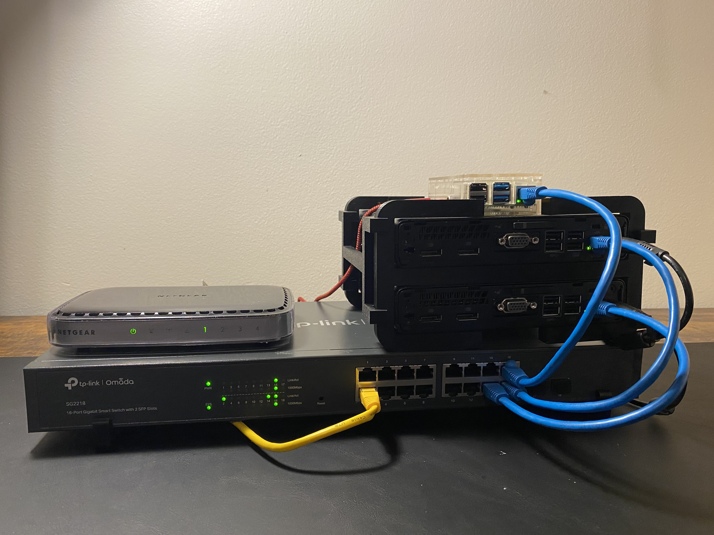

# Ekernik’s Homelab

**What this lab demonstrates**
- Virtualization & clustering with **Proxmox VE**
- Linux server admin (RHEL/Ubuntu), **Nginx reverse proxy**, **TLS/Let’s Encrypt**
- **Automation with Ansible**, container workloads with **Docker**
- **DNS** (Technitium), **monitoring/alerting** (Prometheus/Grafana), uptime checks
- Backups & basic hardening (firewall, fail2ban), runbooks and change control

## Table of Contents
- [Photo](#photo)
- [Hardware](#hardware)
- [Software & Services](#software--services)
- [Security, Backups & Monitoring](#security-backups--monitoring)
- [Roadmap](#roadmap)
- [Notes](#notes)

## Photo
  
*Taken: 11 Jul 2025*

## Hardware

| Role        | Model                          | CPU              |   RAM | Storage                            | Notes                 |
| ----------- | ------------------------------ | ---------------- | ----: | ---------------------------------- | --------------------- |
| Router      | Netgear N150 WNR1000           | –                |     – | –                                  | Edge router to switch |
| Switch      | TP-Link Omada SG2218 (16-port) | –                |     – | –                                  | VLAN-capable L2       |
| Node `pve1` | HP EliteDesk 800 G3 Mini       | i5-6500T (4C/4T) | 16 GB | 256 GB M.2 SSD                     | Proxmox               |
| Node `pve2` | HP EliteDesk 800 G3 Mini       | i5-6500T (4C/4T) | 16 GB | 256 GB M.2 SSD                     | Proxmox               |
| Node `pve3` | Lenovo Ideapad 310-15ISK       | i3-6006U (2C/4T) | 12 GB | 500 GB HDD + 128 GB SSD + 6 TB ext | Proxmox / storage     |
| Utility     | Raspberry Pi 4B                | –                |  4 GB | microSD                            | Lightweight services  |

## Software & Services

**Proxmox Cluster**
- **`pve1`** — Learning node  
	- VM: `ansible-control`
	- VM: `RHEL 9 minimal`
	- VM: `RHEL 9 minimal`
	- VM: `RHEL 9 minimal`
- **`pve2`** — Services  
	- LXC: `Prometheus`
	- LXC: `Grafana`
	- LXC: `Technitium DNS (primary)`
	- LXC: `Nginx Proxy Manager`
	- LXC: `Glance`
	- LXC: `Plex`
- **`pve3`** — Storage + misc  
	- LXC: `NFS server`
    - VM: `media automation stack (Docker compose)  `
        - `Gluetun (Proton VPN)`
        - `qBittorrent`
        - `Radarr`
        - `Sonarr`
        - `Prowlarr`
        - `Bazarr`
        - `Overseerr`

**Raspberry Pi 4B**  (Docker compose)
- `Umami`
- `Uptime Kuma`
- `Technitium (secondary DNS server)`
- `3x Telegram Bots`

## Security, Backups & Monitoring

- **Hardening:** SSH key auth, firewall rules, fail2ban, least-privilege service accounts; regular package updates.
  
- **TLS:** Let’s Encrypt via NPM; HSTS/redirects; internal hostnames only (sanitized).
  
- **Backups:** Proxmox VM/LXC snapshots; off-node data backups (NFS + external HDD) with rotation.
  
- **Monitoring/Alerting:** Node/system exporters → Prometheus → Grafana dashboards; Uptime Kuma external checks; alert rules for service down and disk thresholds.

- **Docs:** lightweight runbooks for deploy, backup/restore, and incident triage.

## Roadmap

- Publish Ansible inventory/roles for base RHEL hardening and service setup

- Add Alertmanager + email/Telegram notifications

- Document VLANs/IP plan (sanitized)

- Create Architecture diagram

- Migrate media stack to isolated network

- Post Grafana dashboard samples and `docker-compose` snippets

## Notes

- All domains, IPs, tokens, and secrets are **redacted** in this repo.
