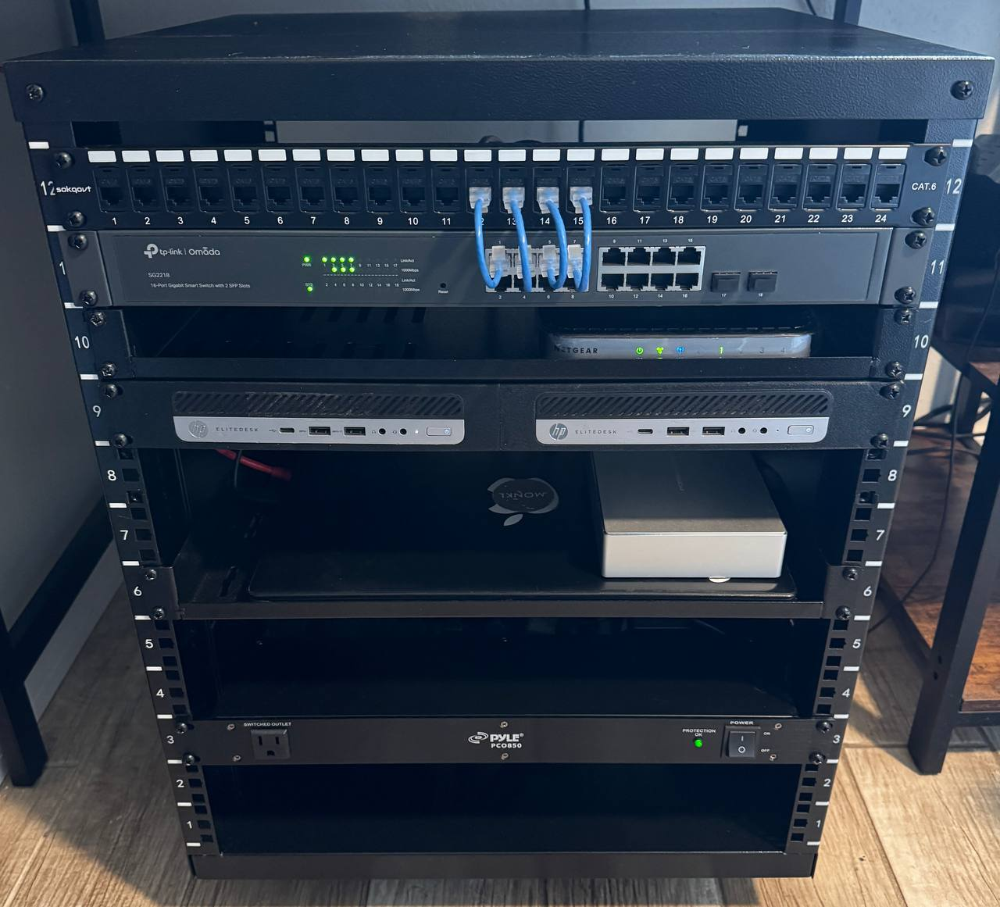

# Ekernik’s Homelab

## Table of Contents

- [Server Rack Photo](#server-rack-photo)
- [Server Rack Layout](#server-rack-layout)
- [Software & Services](#software--services)
- [Roadmap](#roadmap)

## Server Rack Photo

  
_Photo updated: 2026, January 1st_

## Server Rack Layout

| Position | Role                    | Model                                                                                                                                  | CPU              |   RAM | Storage                                     | Notes                                                                                                                             |
| -------- | ----------------------- | -------------------------------------------------------------------------------------------------------------------------------------- | ---------------- | ----: | ------------------------------------------- | --------------------------------------------------------------------------------------------------------------------------------- |
| 12U      | Patch Panel             | [Sokqovt 24-Port](https://www.amazon.com/dp/B0CXPPDT93?ref=ppx_yo2ov_dt_b_fed_asin_title)                                              | –                |     – | –                                           | 24-Port Cat6                                                                                                                      |
| 11U      | Switch                  | [TP-Link SG2218](https://www.amazon.com/dp/B093Y2S3PB?ref=ppx_yo2ov_dt_b_fed_asin_title)                                               | –                |     – | –                                           | Layer 2 switch, 16 ports, Omada                                                                                                   |
| 10U      | Router                  | Netgear N150 WNR1000                                                                                                                   | –                |     – | –                                           | Default Gateway                                                                                                                   |
| 9U       | Node `pve1`, `pve2`     | [HP EliteDesk 800 G3 Mini](https://support.hp.com/us-en/product/details/hp-elitedesk-800-65w-g3-desktop-mini-pc/15497277)              | i5-6500T (4C/4T) | 16 GB | 256 GB M.2 SSD                              | Proxmox Cluster, [3D printed rack mount](https://www.printables.com/model/658936-1u-rackmount-for-hp-elitedesk-g3-mini-and-newer) |
| 8U       | —                       | —                                                                                                                                      | —                |     — | —                                           | reserved for 2 more HP EliteDesk 800 G3 Mini                                                                                      |
| 7U       | —                       | —                                                                                                                                      | —                |     — | —                                           | reserved for Raspberry Pi 5 5x k3s cluster                                                                                        |
| 6U       | Node `pve3`             | [Lenovo 310-15ISK Ideapad Laptop](https://pcsupport.lenovo.com/us/en/products/laptops-and-netbooks/300-series/310-15isk/documentation) | i3-6006U (2C/4T) | 12 GB | 500 GB HDD + 128 GB SSD + 6 TB external HDD | Proxmox Cluster, SMB/NFS                                                                                                          |
| 5U       | —                       | —                                                                                                                                      | —                |     — | —                                           | reserved for Mac Mini running linux                                                                                               |
| 4U       | —                       | —                                                                                                                                      | —                |     — | —                                           | reserved for 1U NAS                                                                                                               |
| 3U       | Power Distribution Unit | [Pyle PCO850](https://www.amazon.com/dp/B00BQO5G4O?ref=ppx_yo2ov_dt_b_fed_asin_title)                                                  | —                |     — | —                                           | 9 outlet, 15A, Surge Protection, AC Filter                                                                                        |
| 2U       | —                       | —                                                                                                                                      | —                |     — | —                                           | reserved for 2U UPS                                                                                                               |
| 1U       | —                       | —                                                                                                                                      | —                |     — | —                                           | reserved for 2U UPS                                                                                                               |

## Software & Services

### Proxmox Cluster

- **`pve1`** — Learning node
  - VM: `ansible-control`
  - VM: `RHEL 9 minimal`
  - VM: `RHEL 9 minimal`
  - VM: `RHEL 9 minimal`
  - VM: `Windows Server 2022 with AD DS`
  - VM: `Windows 11 Enterprise`
- **`pve2`** — Services
  - LXC: `Prometheus`
  - LXC: `Grafana`
  - LXC: `Technitium DNS (primary)`
  - LXC: `Nginx Proxy Manager`
  - LXC: `Glance`
  - LXC: `Plex`
- **`pve3`** — Storage + misc
  - LXC: `NFS server`
    - VM: `media automation stack (Docker compose)`
      - `Gluetun (Proton VPN)`
      - `qBittorrent`
      - `Radarr`
      - `Sonarr`
      - `Prowlarr`
      - `Bazarr`
      - `Overseerr`

### Raspberry Pi 4B

- `Umami`
- `Uptime Kuma`
- `Technitium (secondary DNS server)`
- `3x Telegram Bots`

## Roadmap

- Create Network topology
- Publish Ansible inventory/roles for base RHEL hardening and service setup
- Post Grafana dashboard samples and `docker-compose` snippets
