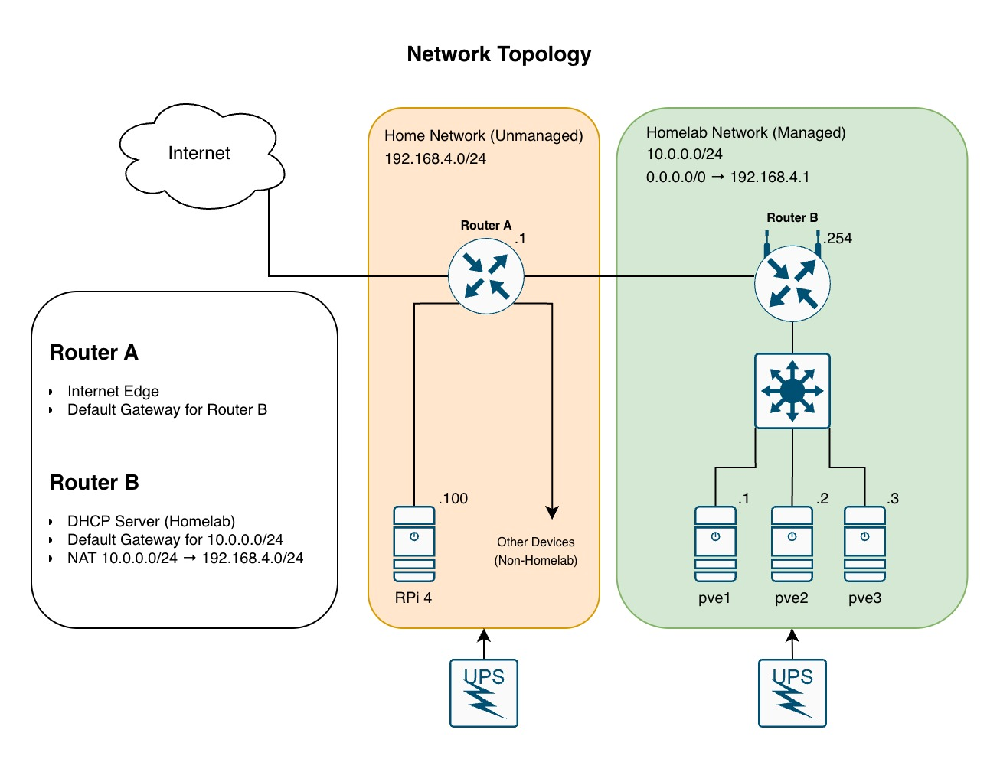

# Ekernik’s Homelab

## Table of Contents

- [Server Rack Photo](#server-rack-photo)
- [Server Rack Layout](#server-rack-layout)
- [Network Topology](#network-topology)
- [Software & Services](#software--services)
- [Roadmap](#roadmap)

## Server Rack Photo

  
_Photo updated: 2026, August 7th_

## Server Rack Layout

| Position | Role                    | Model                                                                                                                                  | CPU              |   RAM | Storage                                     | Notes                                                                                                                             |
| -------- | ----------------------- | -------------------------------------------------------------------------------------------------------------------------------------- | ---------------- | ----: | ------------------------------------------- | --------------------------------------------------------------------------------------------------------------------------------- |
| 12U      | Patch Panel             | [Sokqovt 24-Port](https://www.amazon.com/dp/B0CXPPDT93)                                              | –                |     – | –                                           | 24-Port Cat6                                                                                                                      |
| 11U      | Switch                  | [TP-Link SG2218](https://www.amazon.com/dp/B093Y2S3PB)                                               | –                |     – | –                                           | Layer 2 switch, 16 ports, Omada                                                                                                   |
| 10U      | Default Gateway, DHCP Server                  | [TP-Link ER707-M2](https://www.amazon.com/dp/B0C238XMVV)                                                                                                                   | –                |     – | –                                           | 1x WAN 2.5G + 5x 1G LAN Ports                                                                                                                    |
| 9U       | NAS ([OpenMediaVault](https://www.openmediavault.org))                       | Raspberry Pi 4B                                                                                                                                      | Cortex-A72 (4C/4T) |     4 GB | [256 GB SATA3 SSD](https://www.amazon.com/dp/B087K9L3R5) (OS) + 6 TB external HDD | NFS/SMB server, [metal rack mount for 4x RPies](https://www.amazon.com/dp/B09QQ9TQWL) |
| 8U       | Storage Shelf                       | —                                                                                                                                      | —                |     — | —                                           | Place for [USB CD/DVD Reader](https://www.amazon.com/Rioddas-External-Portable-Rewriter-Superdrive/dp/B07DLRG9VH/ref=sr_1_3) and [6 TB HDD](https://www.amazon.com/LaCie-Porsche-Design-4000GB-Silver/dp/B016A4YCBM/ref=sr_1_1) for NAS |
| 7U       | Node `pve1`, `pve2`     | [HP EliteDesk 800 G3 Mini](https://support.hp.com/us-en/product/details/hp-elitedesk-800-65w-g3-desktop-mini-pc/15497277)              | i5-6500T (4C/4T) | 16 GB | 256 GB M.2 SSD                              | Part of Proxmox Cluster, [3D printed rack mount](https://www.printables.com/model/658936-1u-rackmount-for-hp-elitedesk-g3-mini-and-newer) |
| 6U       | Daily Workstation (2U)                       | [Mac Mini M4](https://www.apple.com/us-edu/shop/buy-mac/mac-mini/m4-chip-10-core-cpu-10-core-gpu-24gb-memory-1tb-storage) | Apple M4 (10C/10T) |     24 GB | 1 TB Internal SSD              | 10 GbE                                                                                               |
| 5U       | Daily Workstation (2U)                       | –//– | –//– | –//– | –//– | –//– |
| 4U       | Node `pve3`             | [Lenovo 310-15ISK Ideapad Laptop](https://pcsupport.lenovo.com/us/en/products/laptops-and-netbooks/300-series/310-15isk/documentation) | i3-6006U (2C/4T) | 12 GB | 500 GB HDD + 128 GB SSD | Part of Proxmox Cluster, on shelf |
| 3U       | Power Distribution Unit | Pyle PCO850 | —                |     — | —                                           | 9 outlet, 15A, Surge Protection, AC Filter                                                                                        |
| 2U       | UPS (2U)                       | [CyberPower CP1500PFCRM2U](https://www.amazon.com/dp/B0B354X985)                                                                                                                               | —                |     — | —                                           | 1500VA/1000W, 8 Outlets                                                                                                               |
| 1U       | UPS (2U)                       | –//– | –//– | –//– | –//– | –//– |

## Network Topology

## Software & Services

### Proxmox Cluster

- **`pve1`** — Learning node
  - VM: `RHEL 10 minimal`
  - VM: `Windows Server 2022 with AD DC`
  - VM: `Windows 11 Enterprise`
  - VM: `net-01`
    - `Technitium DNS (primary)`
    - `Nginx Proxy Manager`
  - VM: `info-01`
    - `Glance Dashboard`
    - `Umami`
  - VM: `mon-01`
    - `Prometheus`
    - `Grafana`
    - `Uptime Kuma`

- **`pve2`** — Services
  - VM: `media-01`
    - `Plex (Docker compose)` 
  - VM: `docs-01`
    - `Paperless-ngx`
- **`pve3`** — Storage + misc
  - LXC: `Telegram bot (in Docker)`
  - LXC: `Twingate connector`
  - VM: `media automation stack (Docker compose)`
    - `Gluetun (Proton VPN)`
    - `qBittorrent`
    - `Radarr`
    - `Sonarr`
    - `Prowlarr`
    - `Bazarr`
    - `Overseerr`

### Raspberry Pi 4B

Runs OpenMediaVault and acts as a  NFS/SMB server. Shares contents of 6 TB HDD.

## Roadmap

- Network:
  - [ ] VLAN
- Topologies:
  - [x] Network Topology
  - [ ] Compute & Virtualization Topology
  - [ ] Storage Topology
  - [ ] Power & Redundancy Topology
- Ansible:
  - [ ] Inventory
  - [ ] Roles
  - [ ] Playbooks
- Documentation
  - [ ] Grafana dashboard samples
  - [ ] Backup recovery process
- Functionality
  - [ ] Automated Backups